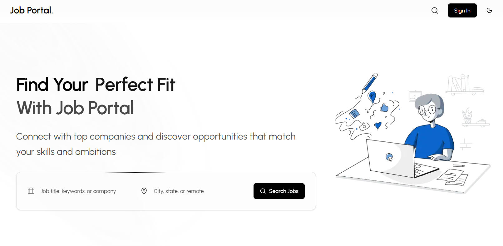

# Job Portal Website

A modern Job Portal Web Application that connects job seekers with employers. Users can search and apply for jobs, while recruiters can post openings, manage applications, and hire talent efficiently.



## 🚀 Features

### 👤 Job Seekers

- User authentication (signup/login)
- Create and manage profiles
- Upload resumes
- Search jobs by title, location, and category
- Apply for jobs
- Track application status
- Save/bookmark jobs

### 🏢 Employers / Recruiters

- Employer authentication
- Create company profiles
- Post, update, and delete job listings
- View applicants and resumes
- Manage hiring status

## ⚙️ Installation & Setup

### Clone the repository

```bash
git clone https://github.com/yourusername/job-portal-nextjs.git
cd job-portal-nextjs
```

## 🤝 Contributing

Contributions are welcome!

- Fork the repo
- Create a feature branch
- Commit changes
- Open a pull request

## 📄 License

This project is licensed under the [MIT License](LICENSE).

Contribute by <a target="_blank" href="https://github.com/akkaldhami">Akkal Dhami</a>